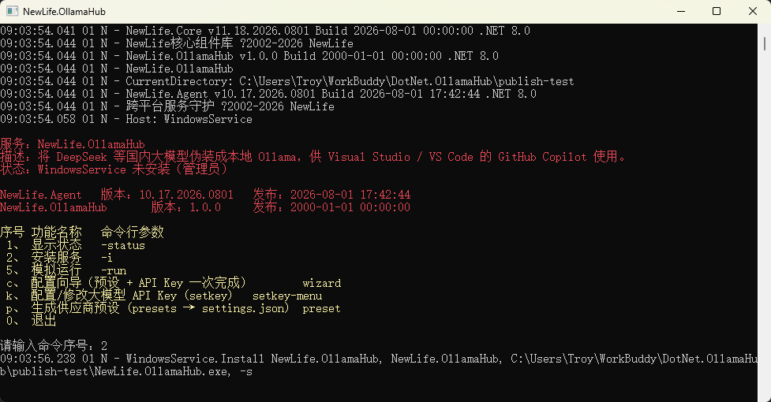
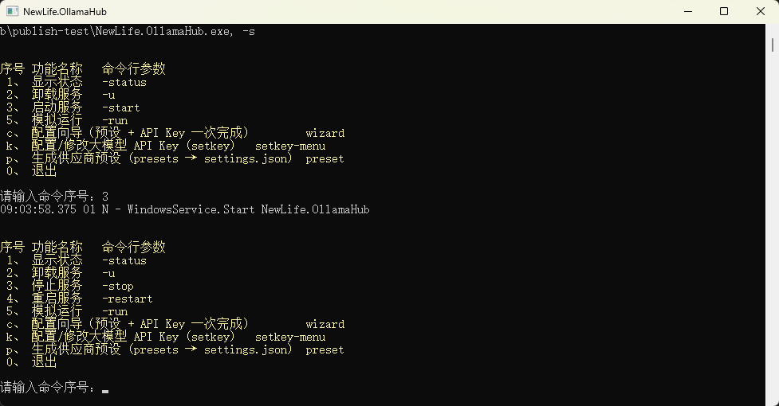

# NewLife.OllamaHub

让 **Visual Studio / VS Code 的 GitHub Copilot Chat** 直接使用 **DeepSeek、通义、Kimi、GLM、硅基流动、火山方舟、混元、ModelScope、OpenRouter、Anthropic Claude、Google Gemini** 等国内（及海外）大模型。

做法：在本机起一个“伪装成本地 Ollama”的 HTTP 服务，Copilot 会把它当成本地 Ollama，模型列表自动出现在模型选择器里——**无需编写任何 IDE 插件**。配合 [NewLife.Agent](https://newlifex.com/core/agent) 装成 Windows 服务，开机自启、崩溃自愈，重启电脑后 Copilot 直接可用。

> 本项目**仅引用 NewLife 生态的 NuGet 包**（`NewLife.Core` + `NewLife.Agent`），零第三方依赖，单文件即可运行。

## 特性

- 🧩 **纯 NewLife 生态**：仅 `NewLife.Core` + `NewLife.Agent`，无 ASP.NET Core / 无运行时依赖。
- 🚀 **服务化一等公民**：`NewLife.Agent` 装成 Windows 服务，开机自启、内存/句柄超限自动重启。
- 🇨🇳 **国内供应商开箱预设**：11 家供应商配置模板，复制即改即用的 `settings.*.json`；也可用 `presets` 子命令一键生成。
- 🧠 **VS 优先 + Agent 友好**：`/api/show` 正确返回 `capabilities`（`tools`），Copilot 的 Agent 模式、读写文件、跑终端命令均可正常工作。
- 📚 **文档齐全 / 安装方便 / 升级方便 / 示例完整**：见 `docs/` 与 `examples/`。

## 快速开始

> 全程图形化 / 右键操作，无需记忆命令行参数。

1. **下载并解压**：从 [GitHub Releases](https://github.com/cuiwenyuan/NewLife.OllamaHub/releases) 下载单文件压缩包，在资源管理器中**右键解压**到任意目录（如 `C:\Tools\NewLife.OllamaHub\`）。
2. **右键安装为服务**：进入解压目录，右键 `NewLife.OllamaHub.exe` → **以管理员身份运行**。弹出的菜单会自动识别状态，按 `2` 安装服务、按 `3` 启动服务即可（菜单项会随服务状态自动变化）。
   
   
3. **可视化配置模型与 Key**：仍在刚才的菜单里，按 `p` 一键生成 11 家供应商预设，按 `k` 逐个填入 API Key（或按 `c` 走配置向导），全程图形化。配置写入后若服务已在运行，会通过**配置热重载**自动生效，无需重启。
   > 菜单快捷键与完整截图见[安装为 Windows 服务](docs/install-as-service.md)。
4. **在 Visual Studio 中接入**：打开 GitHub Copilot Chat → Manage models → 选 Ollama → 端点填 `http://localhost:11434`。详见[VS 接入指南](docs/vs-setup.md)。

（可选）若想手动准备配置：在资源管理器中复制 `settings.sample.json` 并重命名为 `settings.json`，双击用记事本打开填入 `apiKey` 即可，效果同上。

> 开发 / 调试源码时可用控制台模式前台运行（普通用户即可，无需管理员）：
>
> ```bash
> dotnet run --project src/NewLife.OllamaHub --serve
> # 或发布后：
> NewLife.OllamaHub.exe --serve
> ```

## 命令一览

| 命令 | 说明 |
|---|---|
| `-i` / `-install` | 安装为 Windows 服务并启动 |
| `-u` / `-uninstall` | 卸载服务 |
| `--serve` | 前台运行（不装服务、stdin 被重定向时依然可靠，CI/容器/调试用） |
| `-run` | 控制台前台运行（需交互式控制台，调试用） |
| `-status` | 查看服务状态 |
| `-restart` | 重启服务 |
| `self-test` | 内置自检（协议转换等断言，零测试框架） |
| `setkey <provider> <sk-xxx>` | 加密写入/查看/清除某供应商 Key（`setkey --help` 看全部） |
| `presets` | 列出/生成内置 11 家供应商预设（`presets <id>` 出脚手架，`--write` 写入，`--force` 覆盖） |
| `upgrade` | 拉取 GitHub Release 自替换并重启（`--check`/`--dry-run`/`--url` 可选） |

> **配置热重载**：运行期修改 `settings.json`（增删模型、轮换 Key、切换聚合、**修改 `host`/`port` 监听地址**等）均**无需重启**即生效——监听地址变更会自动重建监听套接字（失败回退原地址）；详见[配置参考](docs/configuration.md#配置热重载)。

## 内置 Web 管理面板

启动后浏览器打开 `http://127.0.0.1:11434/admin` 即可查看运行状态、供应商与模型用量（只读、零外部依赖）；`GET /api/status` 返回同等信息的 JSON。详见[配置参考](docs/configuration.md)。

## 里程碑状态

| 阶段 | 内容 | 状态 |
|---|---|---|
| M0 骨架 | 建库 / 目录 / CI 骨架 | ✅ |
| M1 核心链路 | 配置加载 / Ollama 端点 / OpenAI 上游直通 | ✅ |
| M2 流式与工具 | NDJSON⇄SSE 桥 / tools 映射 / thinking 映射 | ✅ |
| M3 服务化 | NewLife.Agent / 安装脚本 / Web 面板 / 单文件发布 | ✅ |
| M4 配置与安全 | **配置热重载** / `setkey` 加密 / **11 家内置预设 `presets`** | ✅ |
| M5 质量与发布 | **self-test 协议全覆盖（156 断言）** / **GitHub Actions 版本化发布** / docs+示例 | ✅ |
| M6 增强（可选） | **统一上游适配层（OpenAI/Anthropic/Gemini/透传 Ollama）** / **多模态图像透传** / **Anthropic·Gemini 原生上游 + 2 家预设（共 11 家）** | ✅ |

## 文档

- [Visual Studio 接入指南](docs/vs-setup.md)
- [架构原理](docs/architecture.md)
- [配置参考](docs/configuration.md)
- [密钥安全](docs/security.md)
- [供应商预设](docs/providers.md)
- [安装为 Windows 服务](docs/install-as-service.md)
- [升级](docs/upgrade.md)
- [排错](docs/troubleshooting.md)
- [常见问题](docs/faq.md)
- [更新日志 ChangeLog](ChangeLog.md)

## 许可证

[MIT](LICENSE) © 2026 cuiwenyuan
