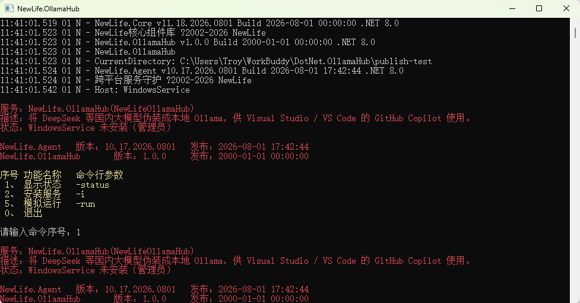
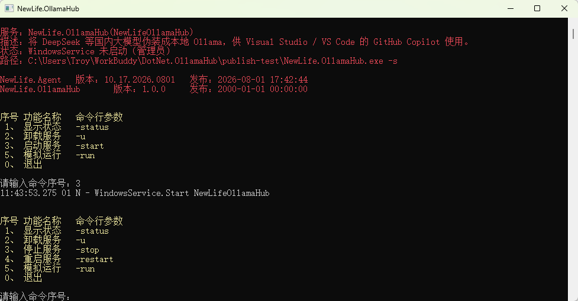

# 安装为 Windows 服务

基于 [NewLife.Agent](https://newlifex.com/core/agent)，把 NewLife.OllamaHub 装成 Windows 服务，实现开机自启、崩溃自愈、内存/句柄超限自动重启。

## 推荐：可视化安装方式（以管理员身份运行）

> 最简单、最推荐的方式：直接右键 `NewLife.OllamaHub.exe`，选择「以管理员身份运行」，会弹出交互式菜单，按数字键即可完成安装、启动、停止、卸载等操作，无需记忆命令行参数。

1. 在资源管理器中找到 `NewLife.OllamaHub.exe`（发布目录或 `publish-test/`）。
2. 右键 → **以管理员身份运行**（安装/卸载 Windows 服务必须管理员权限）。
3. 在弹出的控制台菜单中，根据当前服务状态选择对应序号：
   - **首次安装**：选择「安装服务」（选项 `2`）。
   - **启动服务**：安装完成后选择「启动服务」（选项 `3`）。
   - **停止 / 重启 / 卸载**：服务运行后菜单会动态增加「停止服务」「重启服务」等选项，按提示按 `3` / `4` / `2` 即可。





菜单会根据服务实际状态自动变化（例如未安装时不显示「停止/重启」，运行后不显示「启动」）。操作完成后按 `0` 退出。

### 配置大模型（同一菜单即可完成，推荐）

安装/启动服务**之前或之后**，都可以用菜单里的可视化快捷键完成初始化配置，无需再敲命令行：

| 快捷键 | 功能 | 说明 |
|---|---|---|
| `p` | 生成供应商预设 | 列出 11 家内置供应商，输入 id（如 `deepseek`，空格分隔多个，或 `all` 启用全部），写入 `settings.json`。已存在配置时会询问是否覆盖。 |
| `k` | 配置/修改 API Key | 依次输入「供应商 id」和「API Key」，加密写入 `settings.json`（本地 AES-256，机器绑定）。 |
| `c` | 配置向导 | 一条龙：先生成预设，再逐个提示填写各供应商 API Key。 |

> 推荐顺序：先按 `p`（或 `c`）生成预设，再按 `k`（或 `c` 向导）填密钥。配置写入后，若服务正在运行会通过**配置热重载**自动生效，无需重启；未运行时下次启动加载即生效。
>
> 等价命令行：`NewLife.OllamaHub.exe presets deepseek --write` 与 `NewLife.OllamaHub.exe setkey <providerId> <apiKey>`（详见 `docs/configuration.md`）。

## 命令行一键安装

以**管理员身份**运行（安装 Windows 服务需要管理员权限）：

```bat
install.bat
```

`install.bat` 内部执行：

```bat
NewLife.OllamaHub.exe -i
```

安装完成后服务名为 `NewLifeOllamaHub`，显示名“OllamaHub 模型代理服务”，启动类型为自动（开机自启）。

## 常用命令

| 命令 | 说明 |
|---|---|
| `NewLife.OllamaHub.exe -i` | 安装并启动服务 |
| `NewLife.OllamaHub.exe -u` | 卸载服务 |
| `NewLife.OllamaHub.exe -status` | 查看状态 |
| `NewLife.OllamaHub.exe -restart` | 重启服务 |
| `NewLife.OllamaHub.exe -run` | 控制台前台运行（调试用，不需要管理员） |

或直接运行 `tools/install.bat` / `tools/uninstall.bat`。

## 服务账户说明（重要）

默认以 **LocalSystem** 运行。若把 API Key 加密保存，请使用本项目的 `setkey` 命令（采用 **本地 AES-256，机器绑定、语义等同 DPAPI LocalMachine，且零 NuGet 依赖**），不要使用 DPAPI CurrentUser——否则换账户 / 服务账户后解不开。

如确有需要以“当前登录用户”身份运行服务（例如要使用 CurrentUser 加密或访问用户级资源），可在安装脚本里指定运行账户（需该用户有“作为服务登录”权限）。

## 验证

```bash
# 服务起来后，模型列表接口应返回 JSON
curl http://127.0.0.1:11434/api/tags
```

## 下一步：在 Visual Studio 中使用

服务运行后，打开 Visual Studio 的 GitHub Copilot Chat，按 [vs-setup.md](vs-setup.md) 的步骤把 `http://localhost:11434` 添加为 Ollama 端点，即可使用 `deepseek-chat`、`deepseek-reasoner` 等模型。
