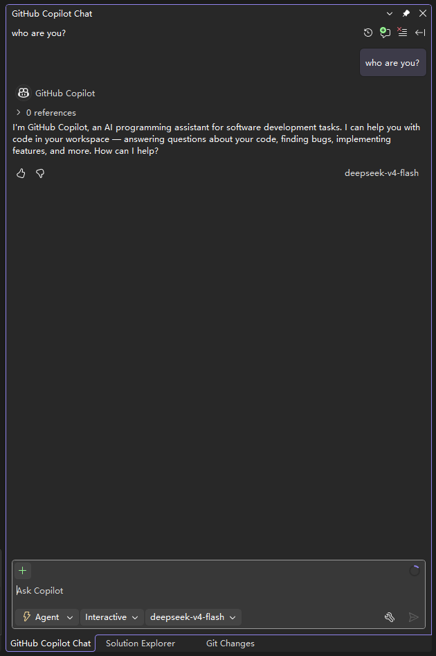

# Visual Studio 接入指南

本服务启动后，对 GitHub Copilot 而言就是一台运行在 `http://localhost:11434` 的本地 Ollama。下面说明如何在 Visual Studio 的 GitHub Copilot Chat 中把模型切到 OllamaHub。

> 也适用于 VS Code：本质都是让 Copilot 把 `localhost:11434` 当作 Ollama 端点。

## 前置条件

1. 已按 [install-as-service.md](install-as-service.md) 安装并启动 `NewLife.OllamaHub` 服务。
2. 已通过菜单 `p` / `k` / `c` 或命令行完成供应商预设与 API Key 配置。
3. 浏览器访问 `http://localhost:11434/admin` 能看到模型列表，确认服务正常。

## 配置步骤

### 1. 打开模型下拉框

在 Visual Studio 的 **GitHub Copilot Chat** 窗口底部，点击当前模型名称（如 `GPT-5 mini`），选择 **Manage models**。


### 2. 选择 Ollama 提供商

在弹出的 **Bring Your Own Model** 对话框中：

- **Choose an available provider** 下拉选择 **Ollama**。


### 3. 填写本地端点

- **Endpoint URL** 保持默认的 `http://localhost:11434`（即 OllamaHub 默认监听地址）。
- 点击 **Add**。

> 若 OllamaHub 改为其他端口，请填入实际地址，如 `http://localhost:11501`。


### 4. 勾选要使用的模型

OllamaHub 会把 `settings.json` 里配置的模型以 Ollama 格式暴露出来。勾选你需要的模型（如 `deepseek-v4-flash`、`deepseek-v4-pro`），然后点击 **Save**。


### 5. 切换模型开始使用

保存后，再次点击模型下拉框，会在 **Other models** 下看到刚才添加的 Ollama 模型。选中 `deepseek-v4-flash` 等模型后，发送消息即可看到模型实际应答。



## 局域网接入（VS 在另一台机器）

若 VS 与 OllamaHub **不在同一台机器**，VS 的 “Ollama” BYO 提供商对非 localhost 地址**强制要求 HTTPS**，因此走 **`lanHttps`**（端口 `11435`）+ 一张**被 VS 机器信任**的证书即可，无需任何 json 编辑或端口替换：

1. 在 OllamaHub 的 `settings.json` 启用 **`lanHttps`** 并配置证书（见 [configuration.md](configuration.md) 的「证书生成」纯 PowerShell 自签命令，导出 `hub.pfx`/`hub.cer`）：
   ```jsonc
   {
     "lanHttps": {
       "enabled": true,
       "host": "0.0.0.0",
       "port": 11435,
       "certificate": "hub.pfx",
       "certPassword": "证书密码（如有）"
     }
   }
   ```
2. 把证书**导入 VS 所在机器**的「受信任的根证书颁发机构」（双击 `hub.cer` 安装并选对存储位置）。**这是关键一步**：证书未真正受信任时 VS 会校验失败、模型列表取不到。
3. 确认网络可达：在 VS 那台机器执行 `curl https://<OllamaHub服务器IP>:11435/v1/models`（自测连通性可加 `-k`）应返回模型列表；拿不到说明证书未受信任或 11435 入站被防火墙挡。
4. 在 VS 里添加 Ollama，Endpoint URL 直接填 **`https://<OllamaHub服务器IP>:11435`**（注意**不要**带 `/v1`，VS 会自动在其后拼 `/v1/models` 等路径），保存后模型列表即正常加载。

> 证书一旦受信任，VS 通过原生 HTTPS 直连 `lanHttps`，无需 `lanHttp` 或任何配置文件改动。`lanHttp`（明文 11436）仅作为可选的明文备选，并非 VS 接入所必需。
>
> 安全提醒：局域网监听面向同网段，Hub 无鉴权，等同把上游 API Key 暴露给同网段任何人。仅限可信网络 / VPN 使用，并妥善保管 Key。

## 常见问题

- **模型列表为空**：先检查 `/admin` 页面里「模型与用量」是否有模型；若没有，执行 `NewLife.OllamaHub.exe presets deepseek --write` 生成预设，并用 `k` 菜单或 `setkey` 命令填入 API Key。
- **连接失败 / 模型加载不出**：确认服务已启动，且 VS 与 OllamaHub 在同一台机器（或访问 `localhost`）。
- **局域网添加 Ollama 后模型出不来**：几乎都是证书未被 VS 机器真正信任所致（VS 对非 localhost 强制 HTTPS，证书校验失败就拿不到模型）。按上文「局域网接入」生成证书并把公钥导入 VS 机器的「受信任的根证书颁发机构」即可；`lanHttp`（明文 11436）只是可选的明文备选，并非必需。
- **没有 Ollama 选项**：更新 Visual Studio / GitHub Copilot 扩展至较新版本；部分旧版本不支持 Bring Your Own Model。
