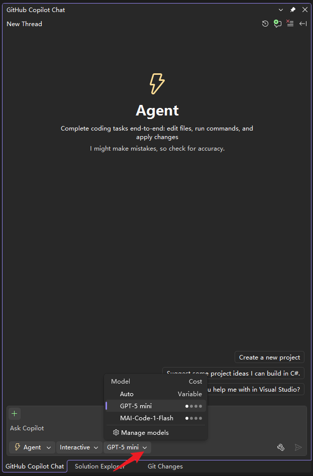
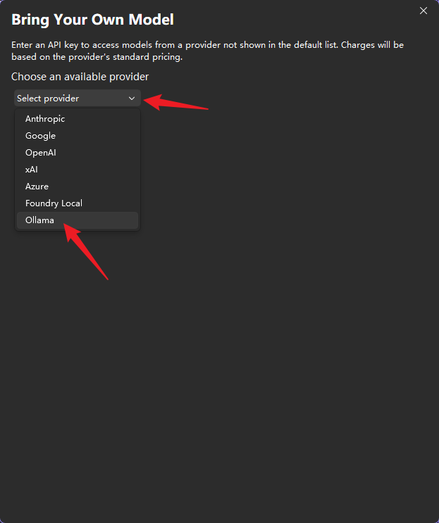
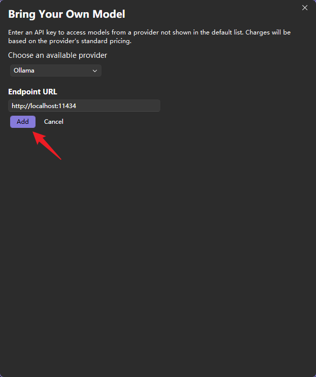
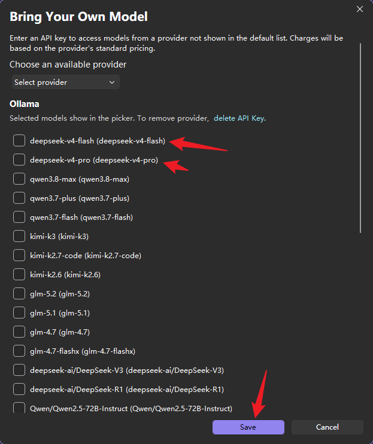
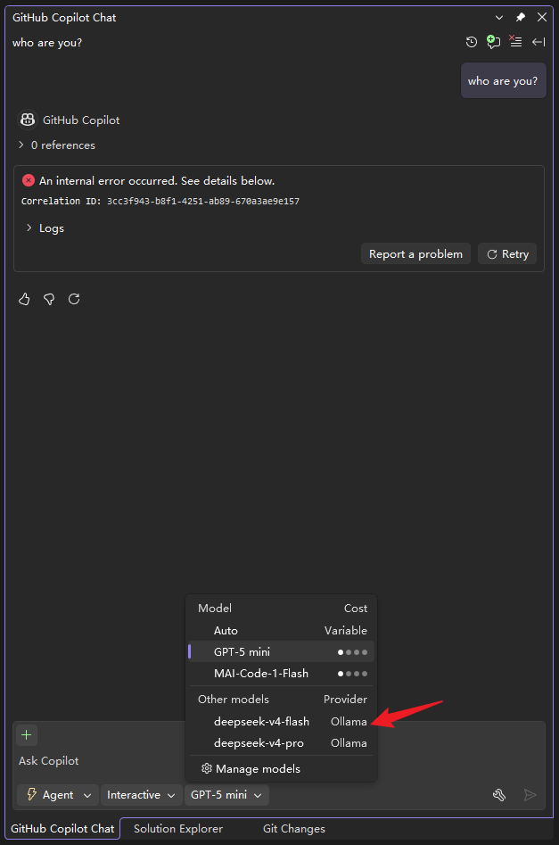

# Visual Studio 接入指南

本服务启动后，对 GitHub Copilot 而言就是一台运行在 `http://localhost:11434` 的本地 Ollama。下面说明如何在 Visual Studio 的 GitHub Copilot Chat 中把模型切到 OllamaHub。

> 也适用于 VS Code：本质都是让 Copilot 把 `localhost:11434` 当作 Ollama 端点。

## 前置条件

1. 已按 [install-as-service.md](install-as-service.md) 安装并启动 `NewLife.OllamaHub` 服务。
2. 已通过菜单 `p` / `k` / `c` 或命令行完成供应商预设与 API Key 配置。
3. 浏览器访问 `http://localhost:11434/admin` 能看到模型列表，确认服务正常。

## 配置步骤

### 1. 打开模型下拉框

在 Visual Studio 的 **GitHub Copilot Chat** 窗口底部，点击当前模型名称（如 `GPT-5 mini`），选择 **Manage models**。

### 2. 选择 Ollama 提供商

在弹出的 **Bring Your Own Model** 对话框中：

- **Choose an available provider** 下拉选择 **Ollama**。

### 3. 填写本地端点

- **Endpoint URL** 保持默认的 `http://localhost:11434`（即 OllamaHub 默认监听地址）。
- 点击 **Add**。

> 若 OllamaHub 改为其他端口，请填入实际地址，如 `http://localhost:11501`。

### 4. 勾选要使用的模型

OllamaHub 会把 `settings.json` 里配置的模型以 Ollama 格式暴露出来。勾选你需要的模型（如 `deepseek-v4-flash`、`deepseek-v4-pro`），然后点击 **Save**。

### 5. 切换模型开始使用

保存后，再次点击模型下拉框，会在 **Other models** 下看到刚才添加的 Ollama 模型。选中即可在 Copilot Chat / Agent 模式中使用。

## 常见问题

- **模型列表为空**：先检查 `/admin` 页面里「模型与用量」是否有模型；若没有，执行 `NewLife.OllamaHub.exe presets deepseek --write` 生成预设，并用 `k` 菜单或 `setkey` 命令填入 API Key。
- **连接失败 / 模型加载不出**：确认服务已启动，且 VS 与 OllamaHub 在同一台机器（或访问 `localhost`）。
- **没有 Ollama 选项**：更新 Visual Studio / GitHub Copilot 扩展至较新版本；部分旧版本不支持 Bring Your Own Model。
